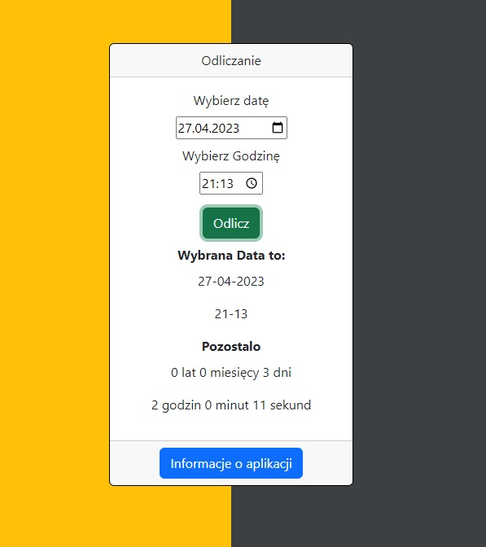

# :desktop_computer: Counting

The application automatically calculates how much time is left until the selected date, indicating the number of years, months, days, hours, minutes, and seconds.

## :framed_picture: Screenshots

## :joystick: Demo

https://kamilkeder.github.io/Counting/

## :e-mail: Feedback

If you have any feedback, please reach out to me at kontaktkkeder@gmail.com
